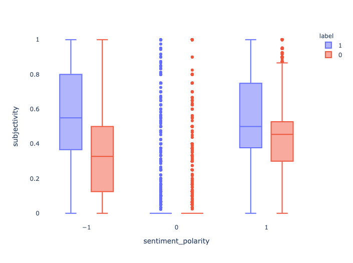
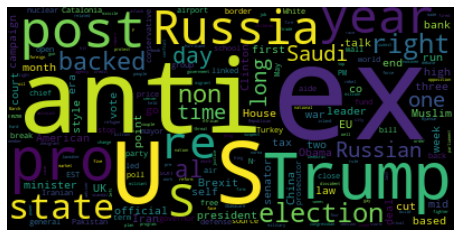
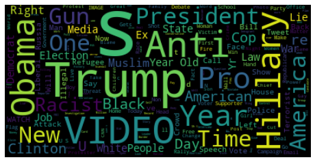
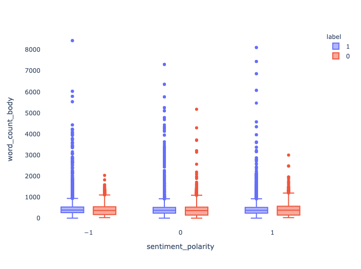

# Feature-Engineering-NLP
Link to my kaggle notebook: (please find my project here, to observe the profiling report and interactive visualizations) : https://www.kaggle.com/breenda/feature-engineering/data   
Textual Data comes in plenty but is unorganised and messy in its raw form. Hence, feature engineering is an important step before training a machine to make predictions based on the given data. 
In my notebook, I have explored a number of preprocessing and feature engineering techniques to gain insights from a collection of fake and real news data.  

## Dataset :  
https://www.kaggle.com/clmentbisaillon/fake-and-real-news-dataset

## Libraries used: 
<li> NLTK </li>
<li> TextBlob </li>
<li> Keras </li>
<li> Tensorflow </li>
<li> HuggingFace Transformers </li>
<li> Regex </li>
<li> Pandas </li>
<li> Sci-kit learn </li>

## Features explored:
<li> Sentiment **Subjectivity** and **Polarity**
</li>
<li> Removed **Stopwords**, **punctuation marks** and lowered casing: </li>
<li> Generated **Lemmatized** and **Stemmed** versions of news title and body </li> 
<li> Generated a **vocabulary** dictionary for the news headlines and plotted a wordcloud plot 
  Frequent words in real news title  Frequent words in fake news title </li>
<li> Generated **word count**, **character count** and **average length** of **phrases** used in the news body 
</li>
<li> Generated **bigrams**, **trigrams** and **TF-IDF matrix** of the news body content. </li>
<li> Generated word vector **embeddings** from pre-trained model GloVe </li>
<li> Generated **encoded tokens** with the help of BertWordPieceTokenizer </li>
<li> Generated **sentiment analysis**, **Name Entity Recognizers** and **Summary** of news body with the help of transformer pipelines</li>
